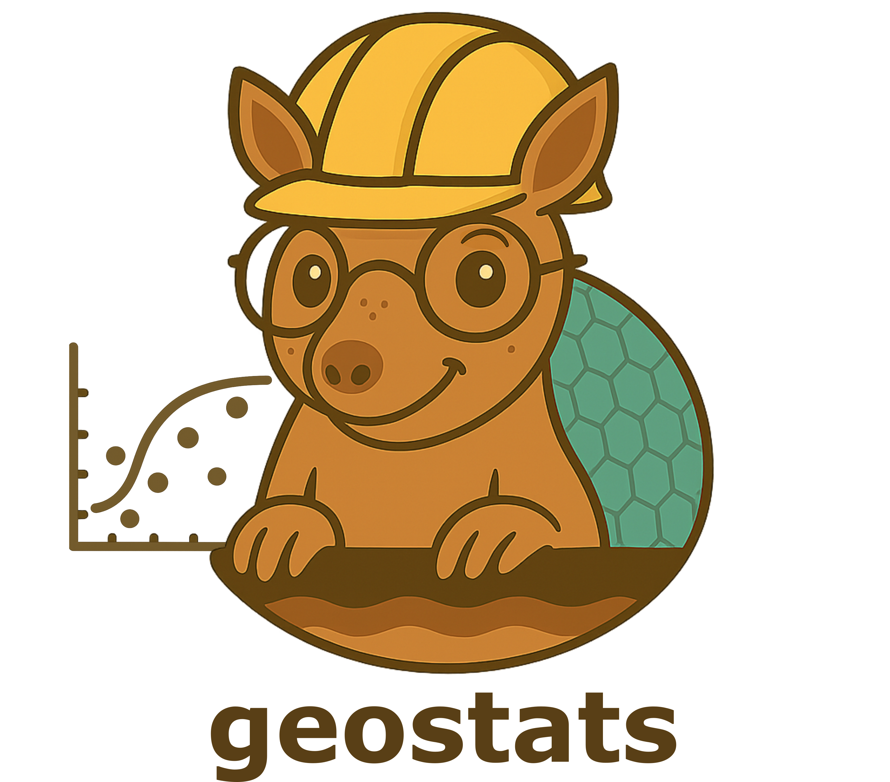

# Geostats
Scripts interativos para aprendizado de Geoestatística \
_Interactive learning scripts for  Geostatistics._

## Como usar _(How o use)_

Esse repositório contém scripts Jupyter Notebook, que podem ser utilizados com o [JupyterHub UFSC](https://notebooks.inf.ufsc.br/) ou o [Google Colab](https://colab.research.google.com/).\
_This repository contains Jupyter Notebook scripts that can be used with [Google Colab](https://colab.research.google.com/)._

**Scripts em Geoestatatística _(Scripts in Geostatistics)_**
- Histograma - impacto da largura do bin _(Histogram - bin width impact)_ [[Colab]](https://colab.research.google.com/github/geoUFSC/geostats/blob/main/BinWidthImpact.ipynb)
- Análise Exploratória de Dados - Jura dataset _(Exploratory Data Analysis - Juta dataset)_ [[Colab]](https://colab.research.google.com/github/geoUFSC/geostats/blob/main/EDA_JuraDataset.ipynb)
- Interpolacao pelo Inverso da Distancia _(Inverse of Distance Weighting Interpolation)_ [[Colab]](https://colab.research.google.com/github/geoUFSC/geostats/blob/main/IDW.ipynb)
- Variograma Experimental - Exemplo _(Experimental Variogram - Example)_ [[Colab]](https://colab.research.google.com/github/geoUFSC/geostats/blob/main/ExpVariogram_Example.ipynb)
- Variograma Teórico - Modelos Permissivos _(Theoretical Variogram - Permissible Models)_ [[Colab]](https://colab.research.google.com/github/geoUFSC/geostats/blob/main/PermissibleModels_TheoVariogram.ipynb)
- Ordinary Kriging usando PyKrige - Elevação do Alasca _(Ordinary Kriging with PyKrige - Alaska elevation)_ [[Colab]](https://colab.research.google.com/github/geoUFSC/geostats/blob/main/OK_PyKrige-Alaska.ipynb)

## Licença _(License)_

Esta obra está licenciada com [Creative Commons Atribuição 4.0 Internacional](https://creativecommons.org/licenses/by/4.0/).\
_This work is licensed under a [Creative Commons Attribution 4.0 International](https://creativecommons.org/licenses/by/4.0/) license._

Compartilhamentos e modificações desses materiais são bem-vindas, desde que seja dado o devido crédito aos autores.\
_Sharing and modifications of these materials are welcome, as long as proper credit is given to the authors._

---
---
#### **PROJETO: REPOSITÓRIO PYTHON PARA GEOTECNIA _(PYTHON REPOSITORY FOR GEOTECHNICS)_**
Este repositório faz parte do projeto de extensão da **Universidade Federal de Santa Catarina** (UFSC) denominado **"Repositório Python para Geotecnia"**, cujo objetivo é desenvolver e compartilhar scripts interativos de geotecnia.\
_This repostitory is part of the extension project of the **Federal University of Santa Catarina** (UFSC) called **"Python Repository for Geotechnics"**, which aims to develop and share interactive scripts for geotechnical engineering._

##### **Contato: _(Contact:)_**
- Prof. Stephanie Thiesen* (coordenadora/_coordinator_): `stephanie.thiesen@ufsc.br` \
 *Para sugestões, entre em contato pelo e-mail \
_*For suggestions, please contact via e-mail_

**Isenção de Responsabilidade:**
Os autores deste projeto não se responsabilizam por quaisquer usos indevidos, imprecisões ou danos resultantes da aplicação dos scripts e funções contidos neste repositório. O uso dos materiais é de responsabilidade exclusiva do usuário. \
**_Disclaimer:_** _The authors of this project are not responsible for any misuse, inaccuracies, or damages resulting from the application of the scripts and functions contained in this repository. The use of the materials is the sole responsibility of the user._

---
---

